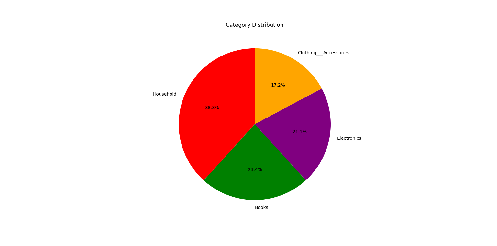
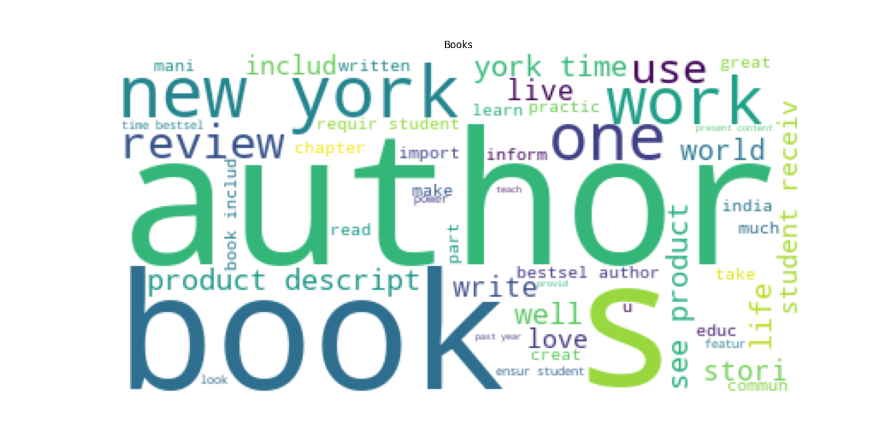
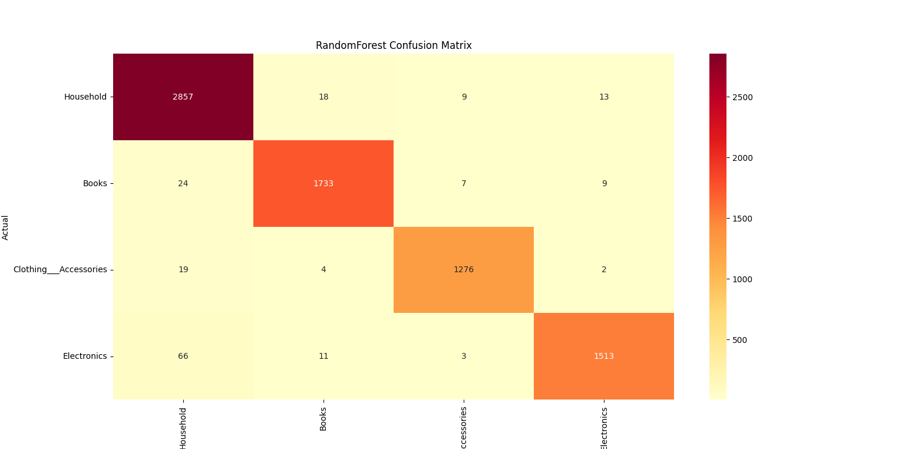
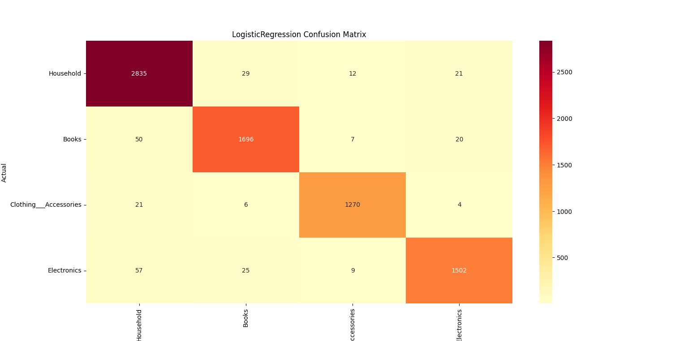

# E-commerce Text Classification

This project focuses on building a machine learning model to automatically classify product descriptions into predefined categories such as    **Household** ,**Books**, **Electronics**, **Clothing&Accessories**.

The dataset used for this project is publicly available on [Zenodo](https://zenodo.org/records/3355823).

# Project Overview
1. Data loading and preprocessing 
2. Exploratory data analysis and visualization
3. Training classification models (Random Forest, Logistic Regression)
4. Evaluating the models with metrics and visualizations
5. Serving predictions using a Flask API

# Category Distribution
Below is a pie chart showing the distribution of samples across product categories.

# Word Cloud-the most frequent words
Here’s an example of a word cloud for the **Books**,showing the most frequent words.

# Confusion Matrix
The confusion matrix for the **Random Forrest** model 

 

The confusion matrix for the **Logistic Regression** model 

 

# API Testing
Example of testing the `/predict` endpoint using Postman.

# How to Run the Project
1. Clone the repository:
-git clone https://github.com/MaltineR/ecommerce-textclassification.git
-cd E-commerce-Text-Classification

# Create a virtual environment and install dependencies

-python -m venv env
-env\Scripts\activate  

# Train model 

-python src/train_model.py
 
# Run the API

-python app.py

# Results
-Random Forest achieved ~97.5% accuracy.
-Logistic Regression achieved ~96.5% accuracy.
-The **prediction script (`predict.py`) uses the trained Random Forest model** to classify new product descriptions. 

Maltine Rama
